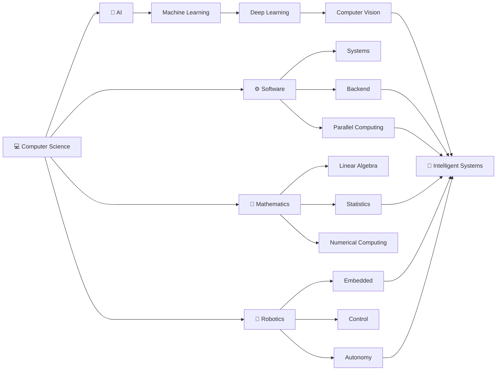

<!-- ========================================================= -->

<!--                    MOHAMMAD ROHAAN                         -->

<!--                 GITHUB DEVELOPER PROFILE                   -->

<!-- ========================================================= -->

<div align="center">


### `AI` × `SOFTWARE` × `DATA` × `MATHEMATICS` × `HARDWARE`

<br/>

[](https://rohaan2802.github.io/)
[](https://www.linkedin.com/in/m-rohaan-944a82320/)
[](https://github.com/rohaan2802)

<br/><br/>


</div>

---

<div align="center">

## 🧭 SYSTEM NAVIGATION

`ABOUT`
  •  
`PROJECTS`
  •  
`AI / ML`
  •  
`ROBOTICS`
  •  
`CS CORE`
  •  
`MATHEMATICS`
  •  
`TECH STACK`
  •  
`COURSEWORK`
  •  
`GITHUB`

</div>

---

# 👨‍💻 Developer Console

```text
┌─[ rohaan2802@github ]────────────────────────────────────────────────────┐
│                                                                          │
│  $ whoami                                                                │
│  > Mohammad Rohaan                                                       │
│  > BS Computer Science                                                   │
│  > FAST-NUCES Islamabad                                                  │
│                                                                          │
│  $ primary-languages                                                     │
│  > C++  •  C  •  Python  •  Java  •  MATLAB                              │
│                                                                          │
│  $ engineering-focus                                                     │
│  > AI / ML  •  Computer Vision  •  Robotics  •  Software Engineering     │
│                                                                          │
│  $ systems                                                               │
│  > Algorithms  •  OS  •  Databases  •  Networks  •  Parallel Computing   │
│                                                                          │
│  $ current-mission                                                       │
│  > Agentic AI  •  Security  •  Statistics  •  FYP                        │
│                                                                          │
│  $ status                                                                │
│  > Building. Learning. Experimenting. █                                  │
│                                                                          │
└──────────────────────────────────────────────────────────────────────────┘
```

---

# 💫 About Me

<table>
<tr>

<td width="25%" align="center">

### 🧠

### AI / ML

Machine Learning
Deep Learning
Computer Vision
NLP
Neural Networks
Agentic AI

</td>

<td width="25%" align="center">

### 💻

### Software

Algorithms
Backend
Databases
Operating Systems
Networks
Software Design

</td>

<td width="25%" align="center">

### 🤖

### Robotics

Embedded Systems
ESP32
Arduino
Sensors
Robot Control
ML for Robotics

</td>

<td width="25%" align="center">

### 📐

### Computing Math

Linear Algebra
Probability
Statistics
Calculus
Differential Equations
Numerical Computing

</td>

</tr>
</table>

I'm a **Computer Science student at FAST-NUCES Islamabad** interested in engineering systems at the intersection of **artificial intelligence, software, mathematics, data, and physical computing**.

My work spans **C/C++ systems programming, Python-based AI/ML, Java/Spring Boot backend development, computer vision, databases, parallel computing, and embedded robotics**.

I particularly enjoy projects where multiple CS domains meet — for example, applying **computer vision to robotics**, using **data structures and algorithms to build software systems**, or combining **concurrency, hardware, sensors, and control logic**.

> ### ⚡ Engineering Direction
>
> **From algorithms → to software → to intelligence → to real-world systems.**

---

# 🧬 Developer DNA

```text
                             ┌─────────────────────┐
                             │  COMPUTER SCIENCE   │
                             └──────────┬──────────┘
                                        │
                 ┌──────────────────────┼──────────────────────┐
                 │                      │                      │
                 ▼                      ▼                      ▼
        ┌────────────────┐     ┌────────────────┐     ┌────────────────┐
        │ INTELLIGENCE   │     │    SOFTWARE    │     │    HARDWARE    │
        └───────┬────────┘     └───────┬────────┘     └───────┬────────┘
                │                      │                      │
          AI • ML • DL            DSA • OS • DB          ESP32 • Arduino
          CV • NLP • Stats        Networks • SE           Sensors • Robots
                │                      │                      │
                └──────────────────────┼──────────────────────┘
                                       │
                                       ▼
                             ┌─────────────────────┐
                             │ INTELLIGENT SYSTEMS │
                             └─────────────────────┘
```

---

# 💻 Primary Language Stack

<div align="center">

### Languages I work with most

<br/>


<br/><br/>


<br/>

### `C++` • `C` • `Python` • `Java` • `MATLAB`

<br/>

**Also work with**


<br/>

`SQL` • `T-SQL` • `x86 Assembly`

</div>

---

# 🚀 Featured Engineering Systems

<table>

<tr>

<td width="50%" valign="top">

## 🏸 ShuttleBot

### Intelligent Badminton Service Robot

**AI • Computer Vision • Robotics**

`Python` `YOLOv8` `OpenCV` `ML`

Computer-vision system for real-time shuttlecock detection as part of an autonomous badminton service robot.

**Engineering Stack**

▸ Object Detection
▸ Dataset Preparation
▸ Image Annotation
▸ Model Training
▸ Model Evaluation
▸ Real-Time Inference
▸ Computer Vision
▸ Robotics Integration

</td>

<td width="50%" valign="top">

## 📚 LibraryMS

### Library Management System

**Backend • Database • Software Engineering**

`Java` `Spring Boot` `SQL` `Thymeleaf`

Structured library platform covering borrowing, fines, administrative operations, reporting and persistence.

**Engineering Stack**

▸ MVC
▸ Dependency Injection
▸ Repository Pattern
▸ Service Layer
▸ Entity Modelling
▸ Transactions
▸ Reporting
▸ Database Integration

</td>

</tr>

<tr>

<td width="50%" valign="top">

## 🌳 Git Lite

### Lightweight Version Control

**Algorithms • DSA • Systems**

`C++` `Trees` `Graphs` `Hashing`

Mini version-control system based on fundamental data structures and repository concepts.

**Engineering Stack**

▸ Commit Trees
▸ Graph Structures
▸ Hashing
▸ File Processing
▸ Diff
▸ Merge
▸ History Traversal
▸ Unit Testing

</td>

<td width="50%" valign="top">

## ✈️ TravelEase

### Travel Management Platform

**Desktop • Database • Analytics**

`C#` `.NET` `SQL Server`

Database-backed travel platform supporting trips, bookings, payments, service providers and reporting.

**Engineering Stack**

▸ ERD / EERD
▸ Relational Modelling
▸ Normalization
▸ Constraints
▸ Database Logic
▸ Application Architecture
▸ Reporting
▸ Analytics

</td>

</tr>

<tr>

<td width="50%" valign="top">

## 🤖 Multi-Robot System

### Synchronized Robotic Cars

**Embedded • Robotics • Sensors**

`ESP32` `Arduino` `Python`

Multi-robot project focused on coordinated movement and hardware/software interaction.

**Engineering Stack**

▸ Embedded Programming
▸ ESP32
▸ Sensor Integration
▸ Ultrasonic Sensors
▸ IMU / Gyroscope
▸ Robot Coordination
▸ Control Logic
▸ Hardware Integration

</td>

<td width="50%" valign="top">

## ✈️ Airline Management

### Concurrent Booking System

**OS • Concurrency • Systems Programming**

`C` `pthreads` `Semaphores`

Concurrent airline simulation applying operating-system synchronization concepts.

**Engineering Stack**

▸ POSIX Threads
▸ Mutexes
▸ Semaphores
▸ Critical Sections
▸ Race Conditions
▸ Shared Resources
▸ Synchronization
▸ Concurrent Transactions

</td>

</tr>

</table>

<details>
<summary><b>🧪 More Software & Experimental Work</b></summary>

<br/>

`Plagiarism Checker`

`Chess`

`Space Shooter`

`Console Notepad`

`Shopping Portal`

`NLP Experiments`

`Machine Learning Notebooks`

`Parallel K-Means`

`Sparse Matrix / HPC Experiments`

`Responsive Web Interfaces`

`Database Applications`

`Robotics Experiments`

</details>

---

# 🧠 AI / ML Control Center

<div align="center">


</div>

<details open>
<summary><b>🧠 Artificial Intelligence</b></summary>

<br/>

### Intelligent Problem Solving

`Intelligent Agents`
`State Spaces`
`Problem Formulation`
`Search Trees`
`Search Graphs`

### Uninformed Search

`Breadth-First Search`
`Depth-First Search`
`Uniform-Cost Search`

### Informed Search

`Heuristics`
`Greedy Best-First Search`
`A* Search`

### Adversarial AI

`Game Trees`
`Minimax`
`Alpha-Beta Pruning`

### Additional Foundations

`Constraint Satisfaction`
`Knowledge Representation`
`Reasoning`
`Decision Making`

</details>

<details>
<summary><b>📈 Machine Learning</b></summary>

<br/>

### Learning Paradigms

`Supervised Learning`
`Unsupervised Learning`
`Regression`
`Classification`
`Clustering`

### ML Pipeline

```text
Raw Data
   │
   ▼
Preprocessing
   │
   ▼
Feature Engineering
   │
   ▼
Train / Validation / Test
   │
   ▼
Model Training
   │
   ▼
Evaluation
   │
   ▼
Hyperparameter Tuning
   │
   ▼
Inference
```

### Concepts

`Feature Selection`
`Cross Validation`
`Overfitting`
`Underfitting`
`Bias–Variance Tradeoff`
`Regularization`
`Hyperparameter Tuning`
`Model Evaluation`

</details>

<details>
<summary><b>🧬 Deep Learning & Neural Networks</b></summary>

<br/>

`Perceptrons`
`Artificial Neural Networks`
`Multilayer Networks`
`Activation Functions`
`Forward Propagation`
`Backpropagation`
`Loss Functions`
`Gradient-Based Optimization`
`CNN`
`Feature Extraction`
`Transfer Learning`

</details>

<details>
<summary><b>👁️ Computer Vision</b></summary>

<br/>

`Digital Images`
`Image Processing`
`Image Classification`
`Object Detection`
`Bounding Boxes`
`CNN-Based Vision`
`YOLOv8`
`Annotation`
`Training Pipelines`
`Inference`
`Real-Time Vision`
`Computer Vision for Robotics`

</details>

<details>
<summary><b>💬 Natural Language Processing</b></summary>

<br/>

`Text Preprocessing`
`Tokenization`
`Text Representation`
`Feature Extraction`
`Text Classification`
`NLP Pipelines`
`Language-Based ML Applications`

</details>

### AI / Data Toolkit

<div align="center">


<br/><br/>


</div>

---

# 🤖 Robotics & Embedded Laboratory

<table>

<tr>

<td width="50%" valign="top">

## 🤖 Robotics

```text
Robotics
│
├── Coordinate Frames
├── Homogeneous Transformations
│
├── Kinematics
│   ├── Forward Kinematics
│   └── Inverse Kinematics
│
├── Robot Motion
├── Robot Control
│
├── Perception
│   └── Computer Vision
│
└── Intelligence
    └── Machine Learning for Robotics
```

</td>

<td width="50%" valign="top">

## 🔌 Embedded Computing

```text
Embedded Systems
│
├── Microcontrollers
│   ├── ESP32
│   └── Arduino
│
├── Sensors
│   ├── Ultrasonic
│   └── IMU / Gyroscope
│
├── GPIO
├── Serial Communication
├── Control Logic
│
└── Hardware ↔ Software Integration
```

</td>

</tr>
</table>

<div align="center">


<br/><br/>


</div>

---

# 💻 Computer Science Core

> Click a module to explore the knowledge area.

<details>
<summary><b>🌳 Data Structures & Algorithms</b></summary>

<br/>

### Linear Structures

`Arrays`
`Linked Lists`
`Stacks`
`Queues`
`Priority Queues`

### Non-Linear Structures

`Trees`
`Binary Trees`
`Binary Search Trees`
`Heaps`
`Graphs`
`Hash Tables`

### Algorithms

`Searching`
`Sorting`
`Recursion`
`Divide & Conquer`
`Greedy Algorithms`
`Dynamic Programming`
`BFS`
`DFS`
`Shortest-Path Concepts`
`Minimum-Spanning-Tree Concepts`

### Complexity

`Time Complexity`
`Space Complexity`
`Big-O`
`Big-Ω`
`Big-Θ`
`Recurrence Relations`
`Algorithm Correctness`

</details>

<details>
<summary><b>🖥️ Operating Systems</b></summary>

<br/>

```text
Operating Systems
│
├── Processes
│   ├── Process Creation
│   ├── fork()
│   ├── exec()
│   └── wait()
│
├── Threads
│   ├── pthreads
│   └── Multithreading
│
├── Synchronization
│   ├── Race Conditions
│   ├── Critical Sections
│   ├── Mutexes
│   └── Semaphores
│
├── IPC
│   ├── Pipes
│   ├── Named Pipes
│   ├── Signals
│   ├── dup()
│   └── dup2()
│
├── Deadlocks
├── CPU Scheduling
├── Memory Management
├── Virtual Memory
└── File-System Concepts
```

</details>

<details>
<summary><b>⚡ Parallel & Distributed Computing</b></summary>

<br/>

`Parallel Computing`
`Distributed Computing`
`Concurrency`
`Shared Memory`
`Data Parallelism`
`Task Parallelism`
`Parallel Decomposition`
`Synchronization`
`OpenMP`
`Parallel Loops`
`Work Sharing`
`Reductions`
`Scheduling`
`Speedup`
`Scalability`
`Load Balancing`
`Performance Analysis`

</details>

<details>
<summary><b>🗄️ Database Systems</b></summary>

<br/>

### Database Design

`Relational Model`
`ERD`
`EERD`
`Primary Keys`
`Foreign Keys`
`Relationships`
`Functional Dependencies`
`Normalization`

### SQL

`DDL`
`DML`
`JOINs`
`Subqueries`
`Aggregate Functions`
`Views`
`Stored Procedures`
`Triggers`
`Functions`
`Constraints`
`Transactions`

### Database Systems

`ACID`
`Transaction Processing`
`Concurrency Concepts`
`Data Integrity`
`Data Cleaning`

</details>

<details>
<summary><b>🌐 Computer Networks</b></summary>

<br/>

`OSI Model`
`TCP/IP`
`Application Layer`
`Transport Layer`
`Network Layer`
`Data-Link Layer`
`TCP`
`UDP`
`IP Addressing`
`Subnetting`
`Routing`
`Switching`
`DNS`
`DHCP`
`HTTP`
`HTTPS`
`Socket Fundamentals`
`Packet Analysis`
`Cisco Packet Tracer`

</details>

<details>
<summary><b>🏗️ Software Engineering & Design</b></summary>

<br/>

### Engineering

`SDLC`
`Requirements Engineering`
`Functional Requirements`
`Non-Functional Requirements`
`Use Cases`
`Software Modelling`
`Software Architecture`
`Testing`
`Maintenance`
`Version Control`
`Agile Concepts`

### Design

`Object-Oriented Design`
`Modularity`
`Abstraction`
`Separation of Concerns`
`Coupling`
`Cohesion`
`SOLID`
`Layered Architecture`
`MVC`
`Design Patterns`
`UML`

</details>

<details>
<summary><b>🔌 Digital Logic & Computer Organization</b></summary>

<br/>

### Digital Logic

`Binary Systems`
`Boolean Algebra`
`Logic Gates`
`Combinational Logic`
`Sequential Logic`
`Flip-Flops`
`Registers`
`Counters`

### Computer Organization

`CPU Organization`
`Registers`
`Instruction Execution`
`Memory Organization`
`Addressing Modes`
`Machine Instructions`
`Assembly Language`
`x86 Assembly`

</details>

<details>
<summary><b>🔢 Discrete Structures</b></summary>

<br/>

`Propositional Logic`
`Predicate Logic`
`Sets`
`Relations`
`Functions`
`Proof Techniques`
`Mathematical Induction`
`Recurrence Relations`
`Combinatorics`
`Graphs`
`Trees`
`Discrete Probability`

</details>

---

# 📐 Mathematical Computing

<table>

<tr>

<td width="50%" valign="top">

## 📊 Linear Algebra

`Vectors`
`Matrices`
`Systems of Equations`
`RREF`
`Rank`
`Vector Spaces`
`Subspaces`
`Basis`
`Dimension`
`Linear Transformations`
`Eigenvalues`
`Eigenvectors`
`Diagonalization`
`Orthogonality`
`Gram-Schmidt`
`Projections`
`Norms`
`Quadratic Forms`
`SVD`
`PCA`

</td>

<td width="50%" valign="top">

## 🎲 Probability & Statistics

`Probability Rules`
`Conditional Probability`
`Bayes' Theorem`
`Random Variables`
`Discrete Distributions`
`Continuous Distributions`
`Expectation`
`Variance`
`Sampling`
`Descriptive Statistics`
`Correlation`
`Regression Foundations`
`Statistical Inference`

</td>

</tr>

<tr>

<td width="50%" valign="top">

## ∫ Calculus

`Limits`
`Continuity`
`Differentiation`
`Applications of Derivatives`
`Integration`
`Applications of Integrals`
`Analytical Geometry`
`Optimization Foundations`

</td>

<td width="50%" valign="top">

## 📈 Differential Equations

`First-Order ODEs`
`Higher-Order ODEs`
`Reduction of Order`
`Cauchy-Euler`
`Undetermined Coefficients`
`Variation of Parameters`
`Laplace Transforms`
`Power Series`
`Heat Equation`
`Wave Equation`
`PDE Foundations`

</td>

</tr>

</table>

<details>
<summary><b>🔢 Numerical Computing</b></summary>

<br/>

`Floating-Point Computation`
`Numerical Error`
`Root Finding`
`Interpolation`
`Approximation`
`Numerical Linear Algebra`
`Numerical Differentiation`
`Numerical Integration`
`Numerical Equation Solving`
`Computational Problem Solving`

</details>

---

# ☕ Backend Engineering

<table>

<tr>

<td width="50%" valign="top">

### Java / Spring

`Java`
`Spring Boot`
`Spring MVC`
`Dependency Injection`
`Repository Pattern`
`Service Layer`
`Entity Modelling`
`Transactions`
`Validation`
`Exception Handling`

</td>

<td width="50%" valign="top">

### Application / Database

`REST APIs`
`CRUD`
`SQL Server`
`MySQL`
`MongoDB`
`T-SQL`
`Database Design`
`Stored Procedures`
`Triggers`
`C# / .NET`

</td>

</tr>

</table>

<div align="center">


</div>

---

# 🛠️ Technology Command Center

<table>

<tr>
<td width="33%" valign="top">

### 💻 Languages

**Primary**

`C++`
`C`
`Python`
`Java`
`MATLAB`

**Additional**

`C#`
`JavaScript`
`SQL / T-SQL`
`x86 Assembly`
`HTML`
`CSS`

</td>

<td width="33%" valign="top">

### ⚙️ Technologies

`Spring Boot`
`.NET`
`PyTorch`
`TensorFlow`
`Scikit-learn`
`OpenCV`
`YOLOv8`
`OpenMP`
`POSIX pthreads`
`ROS`

</td>

<td width="33%" valign="top">

### 🔧 Tools

`Git`
`GitHub`
`Docker`
`CMake`
`Gradle`
`Linux`
`Ubuntu / WSL`
`Visual Studio`
`VS Code`
`MATLAB`
`Arduino IDE`
`Packet Tracer`

</td>
</tr>

</table>

<div align="center">


</div>

---

# 🎓 Academic Knowledge Explorer

<details>
<summary><b>💻 Programming & Software Development</b></summary>

<br/>

```text
Programming
├── Programming Fundamentals
│   └── Programming Fundamentals Lab
│
├── Object-Oriented Programming
│   └── OOP Lab
│
├── Data Structures
│   └── Data Structures Lab
│
├── Design & Analysis of Algorithms
├── Software Design & Analysis
└── Software Engineering
```

**Knowledge developed:** programming logic, structured programming, pointers, memory, OOP, abstraction, data structures, algorithms, complexity, software architecture and engineering practices.

</details>

<details>
<summary><b>🖥️ Computer Systems</b></summary>

<br/>

```text
Systems
├── Digital Logic Design
│   └── DLD Lab
│
├── Computer Organization & Assembly Language
│   └── COAL Lab
│
├── Operating Systems
│   └── OS Lab
│
├── Computer Networks
│   └── CN Lab
│
└── Parallel & Distributed Computing
```

**Knowledge developed:** digital systems, processor architecture, assembly, processes, threads, IPC, synchronization, networking, parallelism and distributed-computing fundamentals.

</details>

<details>
<summary><b>🧠 Artificial Intelligence & Robotics</b></summary>

<br/>

```text
Intelligent Systems
├── Robotics Technology
├── Artificial Intelligence
│   └── AI Lab
├── Embedded Control of Robotics
└── Machine Learning for Robotics
```

**Knowledge developed:** intelligent search, machine learning, perception, robot kinematics, embedded control, sensor integration and intelligent robotic systems.

</details>

<details>
<summary><b>📊 Data, Mathematics & Scientific Computing</b></summary>

<br/>

```text
Mathematical Computing
├── Applied Calculus
├── Calculus & Analytical Geometry
├── Linear Algebra
├── Differential Equations
├── Probability & Statistics
└── Numerical Computing
```

**Knowledge developed:** continuous mathematics, vectors and matrices, differential systems, probability, statistics, numerical approximation and mathematical foundations of AI.

</details>

<details>
<summary><b>⚡ Electronics & Physical Computing Foundations</b></summary>

<br/>

```text
Physical Computing
├── Linear Circuits & Electrical Networks
│   └── Lab
├── Applied Physics
├── Digital Logic Design
└── Embedded Control of Robotics
```

**Knowledge developed:** circuits, electrical foundations, digital systems, physical computing and hardware/software interaction.

</details>

<details>
<summary><b>📝 Communication & Professional Development</b></summary>

<br/>

```text
Professional Development
├── English Language
├── Communication & Presentation Skills
│   └── Lab
├── Technical & Business Writing
└── Professional Practices in IT [Current]
```

**Knowledge developed:** technical communication, documentation, presentations, professional writing and computing professionalism.

</details>

---

# 🛰️ Current Mission

<table>

<tr>

<td width="25%" align="center">

## 🤖

### Agentic AI

Agents
Planning
Reasoning
Tool Use
AI Workflows

**CURRENT**

</td>

<td width="25%" align="center">

## 🔐

### Information Security

CIA Triad
Authentication
Access Control
Cryptography
Secure Systems

**CURRENT**

</td>

<td width="25%" align="center">

## 📊

### Statistical Modelling

Regression
Estimation
Inference
Interpretation
Evaluation

**CURRENT**

</td>

<td width="25%" align="center">

## 🌱

### Digital Sustainability

Green IT
Energy Efficiency
E-Waste
Hardware Lifecycle
Sustainable Computing

**CURRENT**

</td>

</tr>

</table>

<details>
<summary><b>🎓 Final Year Project I</b></summary>

<br/>

Currently progressing through **Final Year Project I**, applying accumulated knowledge from software engineering, AI/ML, research, data analysis and system development toward a larger computer-science project.

</details>

---

# 🧩 How My Skills Connect

```text
C / C++
   │
   ├──────────────► Data Structures & Algorithms
   │                         │
   │                         ▼
   ├──────────────► Operating Systems
   │                         │
   │                         ▼
   └──────────────► Parallel Computing
                             │
                             ▼
                       SYSTEMS SOFTWARE


Python
   │
   ├──────────────► Machine Learning
   │                         │
   │                         ▼
   ├──────────────► Deep Learning
   │                         │
   │                         ▼
   └──────────────► Computer Vision ──────► Robotics


Java
   │
   └──────────────► Spring Boot
                             │
                             ▼
                    Backend Engineering
                             │
                             ▼
                        Databases


MATLAB + Mathematics
   │
   ├──────────────► Linear Algebra
   ├──────────────► Numerical Computing
   ├──────────────► Robotics
   └──────────────► Mathematical Modelling
```

---

# 🔬 Engineering Interests

<div align="center">

|     🧠 Intelligence     |      💻 Software      | 🤖 Physical Computing |    📊 Computing Science    |
| :---------------------: | :-------------------: | :-------------------: | :------------------------: |
| Artificial Intelligence |  Backend Engineering  |        Robotics       |         Algorithms         |
|     Machine Learning    | Software Architecture |    Embedded Systems   |     Parallel Computing     |
|      Deep Learning      |  Systems Programming  |   Autonomous Systems  |     Numerical Computing    |
|     Computer Vision     |       Databases       |     Sensor Systems    |    Statistical Computing   |
|           NLP           |  Distributed Systems  |    Robot Perception   |   Mathematical Computing   |
|        Agentic AI       |    Software Design    |  Intelligent Control  | High-Performance Computing |

</div>

---

# 📊 GitHub Dashboard

<div align="center">


<br/><br/>


</div>

---

# 🐍 Contribution Activity

<div align="center">

<picture>
  <source
    media="(prefers-color-scheme: dark)"
    srcset="https://raw.githubusercontent.com/rohaan2802/rohaan2802/output/github-contribution-grid-snake-dark.svg"
  />
  <source
    media="(prefers-color-scheme: light)"
    srcset="https://raw.githubusercontent.com/rohaan2802/rohaan2802/output/github-contribution-grid-snake.svg"
  />
  
</picture>

</div>


> Contribution animation appears after the corresponding GitHub Actions workflow generates the SVG.

---

# 🎯 Development Roadmap



---

# 🤝 Collaboration Terminal

```text
┌──────────────────── OPEN TO COLLABORATION ────────────────────┐
│                                                               │
│  AI / Machine Learning        Robotics & Autonomous Systems   │
│  Computer Vision              Backend Engineering             │
│  Deep Learning                Embedded Systems                │
│  Data / Scientific Computing Parallel & Distributed Systems   │
│  Software Engineering        Intelligent Systems              │
│                                                               │
└───────────────────────────────────────────────────────────────┘
```

---

<div align="center">

## 🌐 Connect

[](https://www.linkedin.com/in/m-rohaan-944a82320/)
[](https://rohaan2802.github.io/)
[](https://github.com/rohaan2802)

<br/><br/>


<br/>

### `C++` • `C` • `Python` • `Java` • `MATLAB` • `AI` • `Robotics`


</div>
