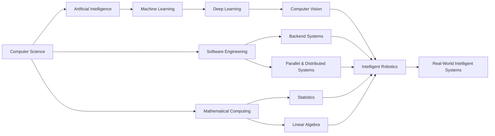

<!-- ========================= HERO ========================= -->

<div align="center">


<br/>

### `Software` × `Intelligence` × `Data` × `Mathematics` × `Hardware`

<br/>

[](https://rohaan2802.github.io/)
[](https://www.linkedin.com/in/m-rohaan-944a82320/)
[](https://github.com/rohaan2802)
[](mailto:m.rohaanarshad@gmail.com)

<br/>


</div>

---

<!-- ========================= NAVIGATION ========================= -->

<div align="center">

## 🧭 Developer Dashboard

**[🧠 AI & ML](#-artificial-intelligence--machine-learning)**
  •  
**[🤖 Robotics](#-robotics--embedded-systems)**
  •  
**[💻 CS](#-computer-science-core)**
  •  
**[📐 Mathematics](#-mathematical-foundations)**
  •  
**[🚀 Projects](#-featured-engineering-projects)**
  •  
**[📊 Analytics](#-github-dashboard)**

</div>

---

# 👨‍💻 Developer Profile

<table>
<tr>
<td width="50%" valign="top">

### 🧠 Primary Focus

```yaml
name: Mohammad Rohaan
field: Computer Science

focus:
  - Artificial Intelligence
  - Machine Learning
  - Computer Vision
  - Robotics
  - Software Engineering

interests:
  - Intelligent Systems
  - Autonomous Systems
  - Backend Engineering
  - Embedded Computing
  - Parallel Computing
```

</td>

<td width="50%" valign="top">

### ⚡ Current Environment

```yaml
education:
  BS Computer Science
  FAST-NUCES Islamabad

currently_exploring:
  - Agentic AI
  - Information Security
  - Statistical Modelling
  - Digital Sustainability

building:
  - AI Systems
  - Robotics
  - Backend Applications
  - Computer Vision Systems
```

</td>
</tr>
</table>

---

# 💫 About Me

<table>
<tr>
<td width="33%" align="center">

### 🧠 AI

Machine Learning
Deep Learning
Computer Vision
NLP
Neural Networks
Agentic AI

</td>

<td width="33%" align="center">

### ⚙️ Engineering

Software Engineering
Backend Systems
Databases
Distributed Computing
Operating Systems
Algorithms

</td>

<td width="33%" align="center">

### 🤖 Robotics

Embedded Systems
ESP32
Arduino
Sensors
Robot Control
ML for Robotics

</td>
</tr>
</table>

I am a **Computer Science student at FAST-NUCES Islamabad** interested in designing systems at the intersection of **AI, software engineering, mathematical computing, and robotics**.

My work ranges from training computer-vision models and developing backend systems to implementing data structures, concurrent programs, databases, and embedded robotic systems.

> ### 💡 Engineering Goal
>
> Build systems where **algorithms become software, software becomes intelligence, and intelligence interacts with the real world.**

---

# 🚀 Featured Engineering Projects

<table>
<tr>

<td width="50%" valign="top">

### 🏸 ShuttleBot

**AI-Powered Badminton Service Robot**

`YOLOv8` `Python` `Computer Vision` `Robotics`

Real-time shuttlecock detection system developed for autonomous badminton robotics.

**Core Engineering**

* Object Detection
* Dataset Preparation
* Model Training
* Real-Time Inference
* Computer Vision
* Robotics Integration

</td>

<td width="50%" valign="top">

### 📚 Library Management System

**Full-Stack Library Platform**

`Java` `Spring Boot` `SQL` `Thymeleaf`

Backend-driven library system implementing structured application architecture and database workflows.

**Core Engineering**

* MVC
* Dependency Injection
* Repository Pattern
* Service Layer
* Transactions
* Reporting

</td>

</tr>

<tr>

<td width="50%" valign="top">

### ✈️ TravelEase

**Travel Management Platform**

`C#` `.NET` `SQL Server`

Database-oriented travel management application supporting bookings, payments, trips and analytics.

**Core Engineering**

* ERD / EERD
* Relational Modelling
* Database Constraints
* Backend Logic
* Reporting
* Application Architecture

</td>

<td width="50%" valign="top">

### 🌳 Git Lite

**Mini Version-Control System**

`C++` `DSA` `Trees` `Graphs` `Hashing`

Version-control system implementing fundamental repository and commit-management concepts.

**Core Engineering**

* Trees
* Graphs
* Hashing
* Commit History
* Diff / Merge
* File Processing

</td>

</tr>

<tr>

<td width="50%" valign="top">

### ✈️ Concurrent Airline System

**Concurrent Booking Simulation**

`C` `pthreads` `Mutexes` `Semaphores`

Operating-systems project focused on synchronization and concurrent resource access.

**Core Engineering**

* Threads
* Race Conditions
* Critical Sections
* Mutexes
* Semaphores
* Synchronization

</td>

<td width="50%" valign="top">

### 🤖 Multi-Robot System

**Synchronized Robotic Cars**

`ESP32` `Arduino` `Python` `Sensors`

Hardware/software system for synchronized robotic vehicle control.

**Core Engineering**

* Embedded Programming
* Sensor Integration
* Robot Coordination
* Ultrasonic Sensors
* IMU / Gyroscope
* Hardware Integration

</td>

</tr>
</table>

---

# 🧠 Artificial Intelligence & Machine Learning

<div align="center">


</div>

<details open>
<summary><b>🧠 Artificial Intelligence</b></summary>

<br/>

`Intelligent Agents`
`Problem Solving`
`State-Space Search`
`BFS`
`DFS`
`Uniform-Cost Search`
`Heuristic Search`
`Greedy Best-First Search`
`A*`
`Adversarial Search`
`Minimax`
`Alpha-Beta Pruning`
`Constraint Satisfaction`
`Knowledge Representation`
`Reasoning`

</details>

<details>
<summary><b>📈 Machine Learning</b></summary>

<br/>

`Supervised Learning`
`Unsupervised Learning`
`Regression`
`Classification`
`Clustering`
`Feature Engineering`
`Data Preprocessing`
`Feature Selection`
`Cross Validation`
`Regularization`
`Bias–Variance Tradeoff`
`Hyperparameter Tuning`
`Model Evaluation`
`Training / Validation / Testing`

</details>

<details>
<summary><b>🧬 Neural Networks & Deep Learning</b></summary>

<br/>

`Perceptrons`
`Artificial Neural Networks`
`Multilayer Networks`
`Activation Functions`
`Forward Propagation`
`Backpropagation`
`Loss Functions`
`Gradient-Based Optimization`
`CNN`
`Feature Extraction`
`Transfer Learning`

</details>

<details>
<summary><b>👁️ Computer Vision</b></summary>

<br/>

`Image Processing`
`Image Classification`
`Object Detection`
`Bounding Boxes`
`CNN-Based Vision`
`YOLOv8`
`Dataset Annotation`
`Training Pipelines`
`Inference Pipelines`
`Real-Time Detection`
`Vision for Robotics`

</details>

<details>
<summary><b>💬 Natural Language Processing</b></summary>

<br/>

`Text Preprocessing`
`Tokenization`
`Text Representation`
`Feature Extraction`
`Text Classification`
`NLP Pipelines`
`Language-Based ML Systems`

</details>

### 🧰 AI / Data Toolkit

<div align="center">


<br/>


</div>

---

# 🤖 Robotics & Embedded Systems

<table>
<tr>
<td width="50%" valign="top">

### 🤖 Robotics

`Forward Kinematics`
`Inverse Kinematics`
`Homogeneous Transformations`
`Coordinate Frames`
`Robot Motion`
`Robot Control`
`Autonomous Systems`
`Multi-Robot Coordination`
`Sensor-Based Robotics`
`ML for Robotics`
`Computer Vision for Robotics`

</td>

<td width="50%" valign="top">

### 🔌 Embedded Systems

`Microcontrollers`
`Embedded Programming`
`GPIO`
`Sensor Integration`
`Ultrasonic Sensors`
`IMU / Gyroscope`
`Actuators`
`Serial Communication`
`Hardware–Software Integration`
`Real-Time Control Concepts`

</td>
</tr>
</table>

<div align="center">


</div>

---

# 💻 Computer Science Core

<details>
<summary><b>🌳 Data Structures & Algorithms</b></summary>

<br/>

### Data Structures

`Arrays`
`Linked Lists`
`Stacks`
`Queues`
`Priority Queues`
`Trees`
`Binary Trees`
`BST`
`Heaps`
`Hash Tables`
`Graphs`
`Adjacency Lists`
`Adjacency Matrices`

### Algorithms

`Searching`
`Sorting`
`Recursion`
`Divide & Conquer`
`Greedy Algorithms`
`Dynamic Programming`
`BFS`
`DFS`
`Shortest Paths`
`Minimum Spanning Trees`

### Analysis

`Time Complexity`
`Space Complexity`
`Big-O`
`Big-Ω`
`Big-Θ`
`Recurrence Relations`
`Algorithm Correctness`
`Performance Analysis`

</details>

<details>
<summary><b>🖥️ Operating Systems & Systems Programming</b></summary>

<br/>

`Processes`
`Threads`
`Multithreading`
`CPU Scheduling`
`Synchronization`
`Critical Sections`
`Race Conditions`
`Mutexes`
`Semaphores`
`Deadlocks`
`IPC`
`Pipes`
`Named Pipes`
`Signals`
`Memory Management`
`Virtual Memory`
`File Systems`

### Linux / POSIX

`fork()`
`exec()`
`wait()`
`pipe()`
`dup()`
`dup2()`
`pthreads`
`POSIX Semaphores`

</details>

<details>
<summary><b>⚡ Parallel & Distributed Computing</b></summary>

<br/>

`Parallel Computing`
`Distributed Computing`
`Concurrency`
`Shared-Memory Programming`
`Data Parallelism`
`Task Parallelism`
`Parallel Decomposition`
`Synchronization`
`Race Conditions`
`Critical Sections`
`OpenMP`
`Parallel Loops`
`Work Sharing`
`Reductions`
`Scheduling`
`Speedup`
`Scalability`
`Load Balancing`
`Performance Analysis`

</details>

<details>
<summary><b>🗄️ Database Systems</b></summary>

<br/>

`Relational Model`
`ERD`
`EERD`
`Primary Keys`
`Foreign Keys`
`Functional Dependencies`
`Normalization`
`Transactions`
`ACID`
`Concurrency`

### SQL

`DDL`
`DML`
`JOINs`
`Subqueries`
`Aggregate Functions`
`Views`
`Stored Procedures`
`Triggers`
`Functions`
`Constraints`
`Transactions`
`Data Cleaning`

</details>

<details>
<summary><b>🌐 Computer Networks</b></summary>

<br/>

`OSI Model`
`TCP/IP`
`Application Layer`
`Transport Layer`
`Network Layer`
`Data-Link Layer`
`IP Addressing`
`Subnetting`
`Routing`
`Switching`
`TCP`
`UDP`
`DNS`
`DHCP`
`HTTP / HTTPS`
`Sockets`
`Packet Analysis`

</details>

<details>
<summary><b>🏗️ Software Engineering & Design</b></summary>

<br/>

`SDLC`
`Requirements Engineering`
`Functional Requirements`
`Non-Functional Requirements`
`Use Cases`
`Software Modelling`
`Software Architecture`
`Testing`
`Maintenance`
`Agile`
`Object-Oriented Design`
`Modularity`
`Abstraction`
`Separation of Concerns`
`Coupling`
`Cohesion`
`SOLID`
`Layered Architecture`
`MVC`
`Design Patterns`
`UML`

</details>

<details>
<summary><b>🔌 Digital Logic & Computer Architecture</b></summary>

<br/>

`Binary Number Systems`
`Boolean Algebra`
`Logic Gates`
`Combinational Logic`
`Sequential Logic`
`Flip-Flops`
`Registers`
`Counters`
`CPU Organization`
`Memory Organization`
`Instruction Execution`
`Addressing Modes`
`Machine Instructions`
`x86 Assembly`

</details>

<details>
<summary><b>🔢 Discrete Structures</b></summary>

<br/>

`Propositional Logic`
`Predicate Logic`
`Sets`
`Relations`
`Functions`
`Proof Techniques`
`Mathematical Induction`
`Recurrence Relations`
`Combinatorics`
`Graphs`
`Trees`
`Discrete Probability`

</details>

---

# 📐 Mathematical Foundations

<table>
<tr>

<td width="50%" valign="top">

### 📊 Linear Algebra

`Vectors`
`Matrices`
`Systems of Equations`
`RREF`
`Rank`
`Vector Spaces`
`Basis & Dimension`
`Linear Transformations`
`Eigenvalues`
`Eigenvectors`
`Diagonalization`
`Orthogonality`
`Gram-Schmidt`
`Projections`
`Quadratic Forms`
`SVD`
`PCA`

</td>

<td width="50%" valign="top">

### 🎲 Probability & Statistics

`Probability Rules`
`Conditional Probability`
`Bayes' Theorem`
`Random Variables`
`Distributions`
`Expectation`
`Variance`
`Sampling`
`Correlation`
`Regression Foundations`
`Statistical Inference`
`Statistical Modelling`

</td>

</tr>

<tr>

<td width="50%" valign="top">

### ∫ Calculus

`Limits`
`Continuity`
`Differentiation`
`Integration`
`Analytical Geometry`
`Optimization Foundations`

</td>

<td width="50%" valign="top">

### 📈 Differential Equations

`First-Order ODEs`
`Higher-Order ODEs`
`Cauchy-Euler`
`Undetermined Coefficients`
`Variation of Parameters`
`Laplace Transforms`
`Power Series`
`Heat Equation`
`Wave Equation`
`PDE Foundations`

</td>

</tr>
</table>

<details>
<summary><b>🔢 Numerical Computing</b></summary>

<br/>

`Floating-Point Computation`
`Numerical Error`
`Root Finding`
`Numerical Linear Algebra`
`Interpolation`
`Approximation`
`Numerical Differentiation`
`Numerical Integration`
`Numerical Equation Solving`
`Computational Problem Solving`

</details>

---

# ☕ Backend & Application Engineering

<div align="center">


</div>

<table>
<tr>
<td width="50%">

### Backend

`Java`
`Spring Boot`
`Spring MVC`
`Dependency Injection`
`Repository Pattern`
`Service Layer`
`REST APIs`
`CRUD`
`Entity Modelling`
`Transactions`
`Validation`
`Exception Handling`

</td>

<td width="50%">

### Database Engineering

`SQL Server`
`MySQL`
`MongoDB`
`T-SQL`
`Database Design`
`Normalization`
`Stored Procedures`
`Triggers`
`Constraints`
`Data Cleaning`

</td>
</tr>
</table>

---

# 🛠️ Technology Command Center

### 👨‍💻 Languages

<div align="center">

[](https://skillicons.dev)

<br/>

`SQL` • `T-SQL` • `x86 Assembly`

</div>

### ⚙️ Frameworks & Technologies

<div align="center">

[](https://skillicons.dev)

</div>

### 🗄️ Databases

<div align="center">

[](https://skillicons.dev)

<br/>


</div>

### 🔧 Developer Tools

<div align="center">

[](https://skillicons.dev)

<br/>

`Ubuntu` • `WSL` • `MATLAB` • `Arduino IDE` • `Cisco Packet Tracer`

</div>

---

# 📚 Academic Knowledge Base

<details>
<summary><b>💻 Programming & Software Courses</b></summary>

<br/>

```text
Programming Fundamentals
├── Programming Fundamentals Lab
├── Object-Oriented Programming
├── Object-Oriented Programming Lab
├── Data Structures
├── Data Structures Lab
├── Design & Analysis of Algorithms
├── Software Design & Analysis
└── Software Engineering
```

</details>

<details>
<summary><b>🖥️ Systems Courses</b></summary>

<br/>

```text
Computer Systems
├── Digital Logic Design
├── Digital Logic Design Lab
├── Computer Organization & Assembly Language
├── Computer Organization & Assembly Language Lab
├── Operating Systems
├── Operating Systems Lab
├── Computer Networks
├── Computer Networks Lab
├── Parallel & Distributed Computing
└── Information Security [Current]
```

</details>

<details>
<summary><b>🧠 AI & Robotics Courses</b></summary>

<br/>

```text
Intelligent Systems
├── Artificial Intelligence
├── Artificial Intelligence Lab
├── Robotics Technology
├── Embedded Control of Robotics
├── Machine Learning for Robotics
└── Agentic Artificial Intelligence [Current]
```

</details>

<details>
<summary><b>📊 Mathematics & Data Courses</b></summary>

<br/>

```text
Mathematical Computing
├── Calculus & Analytical Geometry
├── Linear Algebra
├── Differential Equations
├── Probability & Statistics
├── Numerical Computing
└── Statistical Modelling [Current]
```

</details>

<details>
<summary><b>🌱 Professional & Interdisciplinary Courses</b></summary>

<br/>

```text
Professional Development
├── Communication & Presentation Skills
├── Technical & Business Writing
├── Professional Practices in IT [Current]
├── Digital Sustainability [Current]
└── Final Year Project I [Current]
```

</details>

---

# 🛰️ Currently Exploring

<table>
<tr>
<td align="center" width="25%">

### 🤖

**Agentic AI**

Agents
Planning
Reasoning
Tool Use
Workflows

</td>

<td align="center" width="25%">

### 🔐

**Security**

CIA Triad
Cryptography
Access Control
Secure Systems

</td>

<td align="center" width="25%">

### 📊

**Statistical Modelling**

Regression
Estimation
Inference
Model Evaluation

</td>

<td align="center" width="25%">

### 🌱

**Sustainability**

Green IT
Energy Efficiency
E-Waste
Carbon-Aware IT

</td>
</tr>
</table>

---

# 🧬 Developer DNA

<div align="center">

```text
                    ┌──────────────────────────┐
                    │    INTELLIGENT SYSTEMS   │
                    └────────────┬─────────────┘
                                 │
             ┌───────────────────┼───────────────────┐
             │                   │                   │
             ▼                   ▼                   ▼
      ┌────────────┐      ┌────────────┐      ┌────────────┐
      │ AI / DATA  │      │ SOFTWARE   │      │  ROBOTICS  │
      └──────┬─────┘      └──────┬─────┘      └──────┬─────┘
             │                   │                   │
      ML • DL • CV          Backend • DSA        ESP32 • ROS
      NLP • Stats           OS • Database        Sensors • CV
             │                   │                   │
             └───────────────────┼───────────────────┘
                                 │
                                 ▼
                       ┌──────────────────┐
                       │ REAL-WORLD SYSTEM │
                       └──────────────────┘
```

</div>

---

# 📊 GitHub Dashboard

<div align="center">


<br/>


</div>

---

# 🏆 Achievement Board

<div align="center">


</div>

---

# 📈 Contribution Dashboard

<div align="center">


</div>

---

# 🐍 Contribution Activity

<div align="center">


</div>

> The contribution snake requires a small GitHub Actions workflow in the profile repository to generate the SVG.

---

# 🗺️ What I'm Building Toward



---

# 🤝 Collaboration Console

<table>
<tr>
<td width="50%">

### 💡 Interested In

* AI / ML
* Computer Vision
* Robotics
* Autonomous Systems
* Data Science
* Backend Engineering
* Parallel Computing
* Embedded Systems

</td>

<td width="50%">

### 🤝 Open To

* Open-source projects
* Research projects
* AI/ML projects
* Robotics projects
* Backend systems
* Computer vision systems
* Engineering collaborations
* Technical learning

</td>
</tr>
</table>

---

<div align="center">

# 🌐 Let's Connect

[](https://www.linkedin.com/in/m-rohaan-944a82320/)
[](https://rohaan2802.github.io/)
[](https://github.com/rohaan2802)
[](mailto:m.rohaanarshad@gmail.com)

<br/><br/>

### 💻 Code. 🧠 Learn. 🤖 Build. 🚀 Improve.


</div>
